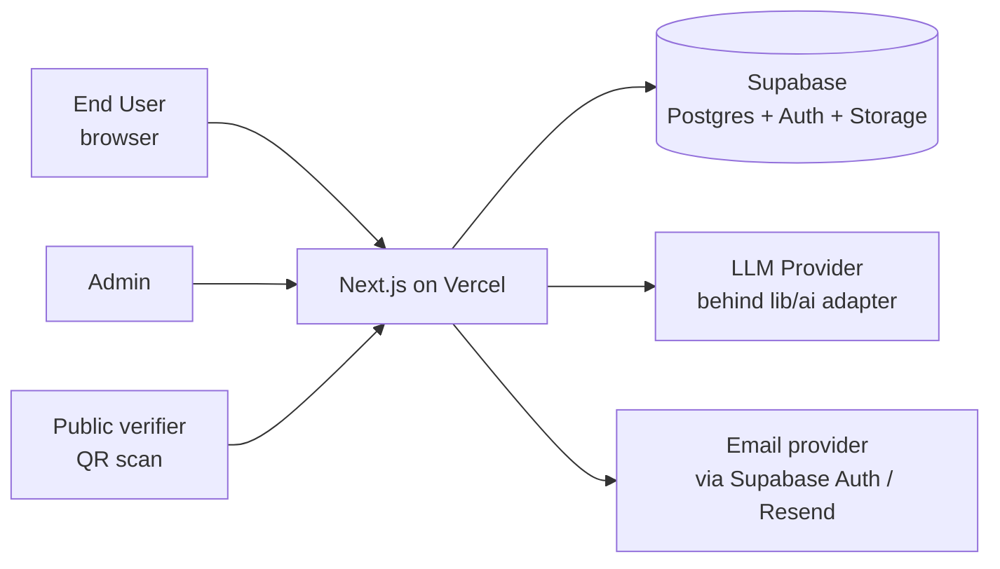
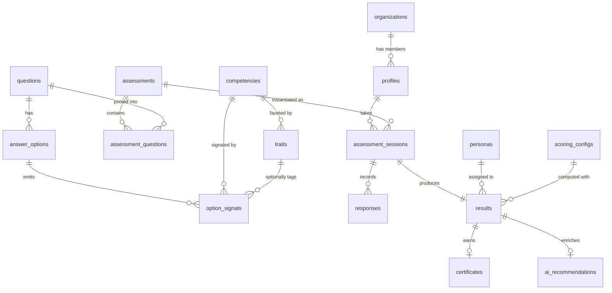
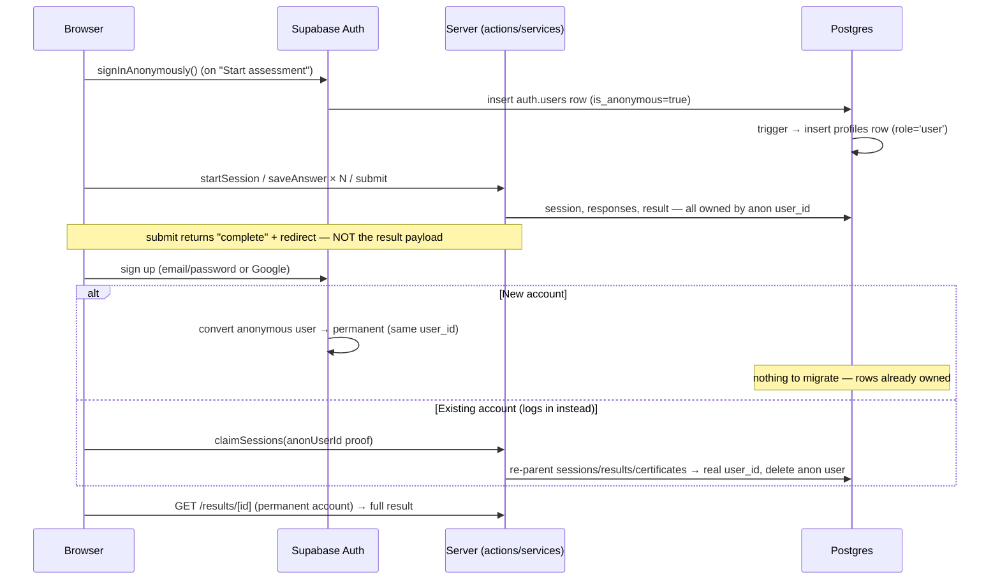
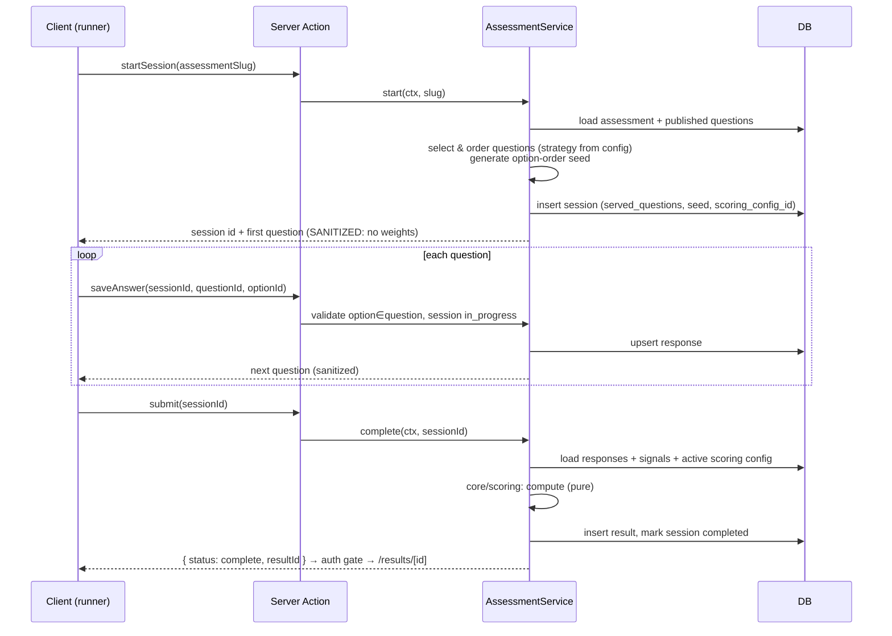

# AIQ — System Architecture

> Status: **v1.1 — approved direction, updated with Founder Decisions of 2026-07-14** (see [CHANGELOG.md](./CHANGELOG.md))
> Companion documents: [PROJECT_STRUCTURE.md](./PROJECT_STRUCTURE.md), [ASSESSMENT_MODEL.md](./ASSESSMENT_MODEL.md), [OPEN_QUESTIONS.md](./OPEN_QUESTIONS.md), [SESSION_1_REVIEW.md](./SESSION_1_REVIEW.md).
> Source of truth for requirements: `docs/00_PROJECT/*` plus the Founder Decisions recorded in CHANGELOG.md. If this document conflicts with those, flag it — do not silently pick one.
> The conceptual model (signals → traits → competencies → personas → recommendations) is defined in ASSESSMENT_MODEL.md; this document implements it.

---

## 1. Overall System Architecture

### 1.1 Shape: a modular monolith

AIQ is a **single Next.js application** (App Router) backed by **Supabase (Postgres + Auth + Storage)**, deployed on **Vercel**. No microservices, no separate API server, no separate admin app.

Why:

- One person/small team, one deployable unit, one CI pipeline. Matches PROJECT_RULES "keep the app deployable at all times".
- Next.js App Router already gives us the seams we need: server components for reads, server actions for mutations, route handlers for public APIs.
- The real modularity requirement ("every feature modular, independently testable") is achieved with **internal module boundaries**, not network boundaries. Splitting services prematurely is the classic way to make a two-person project unmaintainable.

The discipline that makes a monolith stay clean:

```
UI (app/ routes, components)        — knows nothing about SQL or scoring math
   ↓ calls
Feature services (features/*/server) — orchestrate: authz, validation, persistence
   ↓ calls
Domain core (core/)                  — pure TypeScript, zero I/O (scoring, persona rules)
   ↓ receives data from
Data layer (features/*/server/db.ts) — the only place that touches Supabase
```

**Rule: dependencies point downward only.** `core/` imports nothing from the app. UI never imports the data layer directly. This is the "clean architecture" requirement translated into something enforceable (via ESLint import rules).

### 1.2 System context



### 1.3 Trust boundaries (the most important architectural fact)

The single most sensitive invariant in this product: **hidden scoring weights must never reach the client.** This drives everything:

- Competency weights, persona rules, and scoring config live only in server-side code paths and are never included in any payload sent to the browser.
- Question payloads sent to the assessment runner contain **only** `{ id, title, scenario, options: [{ id, content }] }`. No weights, no competency ids, no "correct" markers.
- Scoring runs **exclusively on the server** at submit time. The client submits `{ questionId, optionId }` pairs; it never computes or sees a partial score.
- RLS denies all client-role access to `option_signals`, `traits`, `scoring_configs`, and persona configuration. Only the server (service role / server-side authenticated queries through a dedicated view) reads them. RLS is the backstop; the primary control is that no client code path selects those tables.
- **Anonymous users are still authenticated users** (Supabase anonymous sign-ins), so every session row has a real `user_id` and every RLS policy applies unchanged. Anonymity changes _what they can see_ (no results until account creation — Decision 1), not the trust model.

---

## 2. Frontend Architecture

### 2.1 Route groups

```
app/
  (marketing)/        # landing, learn, pricing — public, static/ISR, SEO-optimized
  (auth)/             # login, signup, reset — public
  (app)/              # dashboard, results, certificate — permanent account required
  assessment/[slug]/  # PUBLIC — anonymous-first runner (Decision 1); auth gate at results
  (admin)/admin/      # CMS — role-gated (super_admin)
  verify/[code]/      # public certificate verification — no auth
  api/                # route handlers (OG images, webhooks, public verify JSON)
```

Each group has its own `layout.tsx` (marketing shell vs. app shell vs. admin shell). Marketing pages are static/ISR for speed and SEO; app pages are dynamic RSC.

### 2.2 Rendering strategy

- **Server Components by default.** Data-reading pages (dashboard, results, admin lists) are RSC that call feature services directly. No client-side fetching layer for reads in MVP.
- **Client Components only where interactivity demands it:** the assessment runner, charts, forms, admin editors. Marked explicitly and kept as leaves of the tree.
- **The assessment runner** is the one genuinely stateful client experience (Typeform-like, one question per screen, animated transitions). See §10.

### 2.3 Design system

- **shadcn/ui as the component base**, restyled via Tailwind tokens to hit the "Apple × Linear × Typeform" bar. shadcn is copied into the repo (`components/ui/`), so we own and can restyle every primitive — this matters for the "premium" requirement.
- Design tokens (spacing scale, radii, shadows, motion durations) defined once in Tailwind config / CSS variables. Light/dark from day one via CSS variables (cheap now, painful later).
- Motion: **Framer Motion** for the assessment flow transitions and results reveal only. Everything else uses CSS transitions. Motion is a garnish, not a framework.
- Charts (results radar/bars, admin analytics): **Recharts** — good enough, tree-shakeable, themeable. Revisit only if the results page design outgrows it.
- Accessibility: shadcn/Radix gives keyboard/ARIA foundations; we add focus management in the assessment flow (each new question moves focus to the question heading) and honor `prefers-reduced-motion`.

---

## 3. Backend Architecture

### 3.1 Where server logic lives

| Concern                                                            | Mechanism                                  |
| ------------------------------------------------------------------ | ------------------------------------------ |
| Reads for pages                                                    | RSC → feature service → data layer         |
| Authenticated mutations                                            | **Server Actions** → feature service       |
| Public/uncookied APIs (cert verification JSON, OG image, webhooks) | **Route Handlers** (`app/api/`)            |
| Post-response work (AI generation, emails)                         | `waitUntil` in MVP; jobs table later (§16) |

Server Actions and Route Handlers are **thin transport adapters**: parse/validate input (Zod), check auth, call the service, shape the response. All business logic lives in services so it is testable without HTTP and reusable across transports. This is what keeps us honest when V3+ needs a real public API (§8.3).

### 3.2 Feature services

One service module per feature (`features/assessment/server/service.ts`, etc.). A service:

1. Receives an **authenticated context** (`{ userId, role, orgId }`) — it never reads cookies itself.
2. Performs **authorization** (explicit role/ownership checks — RLS is defense in depth, not the primary authz).
3. Validates domain invariants (e.g., "this option belongs to this question", "session is still in progress").
4. Calls `core/` for pure computation (scoring) and the data layer for persistence.

### 3.3 Validation

**Zod at every boundary**: server action inputs, route handler inputs, JSONB columns read from the DB (persona rules, scoring config, settings). A JSONB blob is untyped until a Zod schema says otherwise — parse, don't cast.

---

## 4. Database Architecture

### 4.1 Platform decisions

- **Postgres via Supabase.** Migrations managed with the **Supabase CLI** (`supabase/migrations/*.sql`) — plain SQL, versioned, applied in CI. Satisfies "every database change must use migrations".
- **Typed access via `supabase-js` + generated types** (`supabase gen types`). One data-access technology in MVP. Drizzle is a considered-and-deferred option: it shines for complex analytical queries, which we don't have yet; adding a second query layer now costs more than it returns. Revisit at Phase 10 (Analytics).
- **RLS enabled on every table, no exceptions.** Policies written per role in the same migration that creates the table.
- **Soft deletes** (`deleted_at`) on content/user-facing entities; hard deletes only via explicit GDPR-style erasure flows. All RLS policies and queries filter `deleted_at IS NULL` (helper view or query-layer convention).
- **Audit timestamps** (`created_at`, `updated_at` with trigger) on everything; `audit_logs` table for admin mutations.

### 4.2 Entity model



### 4.3 Tables (MVP set)

Core identity & tenancy:

- **`organizations`** — `id, name, slug, logo_url, settings jsonb, created_at, updated_at, deleted_at`. Present from day one (nullable references), even though org features are Phase 8 — retrofitting tenancy is the most expensive migration there is.
- **`profiles`** — `id (= auth.users.id), email, full_name, avatar_url, role, org_id?, created_at, updated_at, deleted_at`. Created by DB trigger on `auth.users` insert. `role` is an enum: `super_admin | org_admin | trainer | user`.

Content (admin-managed, never hardcoded):

- **`competencies`** — `id, slug, name, description, display_order, status, timestamps`. Seeded with the 8 from BLUEPRINT; fully editable (thin-admin CRUD per Decision 2).
- **`traits`** — `id, competency_id, slug, name, description, display_order, status, timestamps`. Facets within a competency (defined in ASSESSMENT_MODEL.md §3). MVP seeds the taxonomy; trait-level display and analytics come later — the layer exists now because retrofitting granularity into an existing signal bank is expensive, adding it later is not.
- **`personas`** — `id, slug, name, description, artwork_url, display_order, status, timestamps`. Seeded with the 5 from BLUEPRINT; fully editable (Decision 2). Signature profiles (used for assignment) live in `scoring_configs`, not here — a persona's identity and its scoring behavior version independently.
- **`questions`** — `id, title, scenario, difficulty, industry_tags text[], status (draft|published|archived), version int, created_by, timestamps, deleted_at`.
- **`answer_options`** — `id, question_id, content, author_position int, timestamps`. No `is_correct` column — there are no right or wrong answers (Decision 4), only behavioral signal.
- **`option_signals`** — `id, option_id, competency_id, trait_id?, weight numeric`. One row = one behavioral signal: "choosing this option is evidence of this competency (optionally this specific trait) at this strength." **The crown jewels. RLS: no client-role access whatsoever.**
- **`assessments`** — `id, slug, title, description, question_count, selection_strategy jsonb, status, org_id?, settings jsonb, timestamps`. `selection_strategy` makes question selection configurable (fixed list / random by tag / adaptive later) instead of hardcoded. Multiple lengths (Decision 8: free 8q, professional 20–30q, enterprise 40–60q) are simply multiple `assessments` rows — no schema change needed, ever.
- **`assessment_questions`** — join table for fixed-list assessments: `assessment_id, question_id, position`.

Runtime:

- **`assessment_sessions`** — `id, user_id, assessment_id, org_id?, status (in_progress|completed|abandoned|expired), served_questions jsonb, option_order_seed text, scoring_config_id, started_at, completed_at`. `served_questions` snapshots exactly which question ids (and versions) were served, in what order — required for reproducibility and for adaptive selection later. `user_id` may reference an **anonymous** auth user (Decision 1); the claim flow (§5.2) re-parents rows when the anonymous identity can't be converted in place. Unclaimed anonymous sessions are purged after a configurable retention window (default 30 days).
- **`responses`** — `id, session_id, question_id, option_id, answered_at, time_spent_ms`. `UNIQUE(session_id, question_id)` — autosave is an upsert.
- **`results`** — `id, session_id UNIQUE, user_id, overall_score int, competency_scores jsonb, persona_id, secondary_persona_id?, persona_affinities jsonb, strengths jsonb, blind_spots jsonb, confidence numeric, scoring_config_id, scoring_snapshot jsonb, timestamps`. Secondary persona is **computed and stored from day one but not displayed in MVP** (Decision 3); `persona_affinities` keeps the full affinity vector so future persona-combination features need no re-scoring. `scoring_snapshot` freezes the exact signals/config used, so a result is reproducible even after admins edit weights. The **newest** result is the user's default profile; history is preserved for the progress-over-time dashboard (Decision 7).
- **`certificates`** — `id, public_code text UNIQUE, result_id, user_id, issued_at, expires_at?, revoked_at?, metadata jsonb`. `public_code` is an unguessable nanoid (~21 chars), not a sequential id.
- **`ai_recommendations`** — `id, result_id, status (pending|generated|failed|reviewed), content jsonb, model, prompt_version, created_at, reviewed_by?`. AI output is data, stored and reviewable — per AI Rules.

Configuration & telemetry:

- **`scoring_configs`** — `id, version int, config jsonb, status (draft|active|retired), created_at, created_by`. Holds normalization rules, competency weighting for the overall score, persona assignment rules, confidence formula parameters. **One active config at a time**; results reference the config they were scored with.
- **`events`** — `id, user_id?, session_id?, type, payload jsonb, created_at`. Append-only product analytics (assessment_started, question_answered, completed, certificate_downloaded, …).
- **`audit_logs`** — `id, actor_id, action, entity_type, entity_id, diff jsonb, created_at`. Written by admin services on every content mutation.

### 4.4 Indexing (day one)

FKs all indexed; plus: `responses(session_id)`, `assessment_sessions(user_id, status)`, `results(user_id)`, `certificates(public_code)` (unique), `questions(status)`, `events(type, created_at)`, `option_signals(option_id)`.

### 4.5 Question versioning

MVP-pragmatic approach: `questions.version` increments on content edit; **editing a published question that has responses forces a new version row is deferred** — instead, sessions snapshot the question content hash in `served_questions`, and admin UI warns when editing a question with existing responses. Full immutable version history is a V2 concern; the schema (version column + snapshot in sessions) leaves the door open without building it now.

---

## 5. Authentication Flow

**Supabase Auth** with `@supabase/ssr` (cookie-based sessions), in an **anonymous-first** flow (Decision 1): users start the assessment with zero friction; account creation is the gate to seeing results.

Methods at launch: **anonymous sign-ins + email/password + Google OAuth**. Magic link optional later (one config flag in Supabase).

### 5.1 The anonymous-first journey



- **New users** (the common path): Supabase converts the anonymous user in place — `updateUser({ email, password })` or `linkIdentity()` for OAuth. The `user_id` never changes, so sessions, responses, and the already-computed result are attached with **zero data movement**.
- **Existing users** who log in instead of signing up get a _different_ `user_id`; a server-side `claimSessions` service re-parents the anonymous user's rows to the real account in one transaction (service-role client, after verifying the caller held the anonymous session), then deletes the orphaned anonymous user. This is the one genuinely fiddly part of Decision 1 and gets its own service tests.
- **The result gate**: `submitAssessment` computes and persists the result but responds only with `{ status: "complete", resultId }`. The results page requires a permanent account (`is_anonymous = false` in the JWT); anonymous holders are routed to the signup gate ("Create your free account to see your results"). Scores never transit to an anonymous client.

### 5.2 Mechanics

- **Middleware** refreshes the session token on every request. Gating: `assessment/*` allows anonymous auth (and silently creates it if missing); `(app)` requires a permanent account; `(admin)` requires a permanent account + role check in the layout. Middleware does _coarse_ gating only; **role checks happen in layouts and services**, never solely in middleware.
- **Custom claims**: a Supabase Auth Hook stamps `role` and `org_id` into the JWT (`is_anonymous` is provided by Supabase natively) so RLS policies can use `auth.jwt()` without joins. Role changes take effect on next token refresh (≤1h); admin demotion can force sign-out.
- Password reset via Supabase's built-in email flow; email templates customized to match brand.
- **Abuse control for anonymous starts**: rate-limit `signInAnonymously` + session-start per IP (also protects the question bank from scraping via repeated anonymous sessions); CAPTCHA on anonymous sign-in is a Supabase toggle we can enable without code changes if abuse appears.
- **Retention**: anonymous users who never register are purged (auth user + cascaded sessions/responses) after the configurable window (default 30 days) via a scheduled cleanup (Supabase cron).

---

## 6. Authorization Model

Four roles (from IMPLEMENTATION_PLAN Phase 2), one enum, escalating scope:

| Capability                                        | user | trainer          | org_admin        | super_admin |
| ------------------------------------------------- | ---- | ---------------- | ---------------- | ----------- |
| Take assessments, view own results/certs          | ✅   | ✅               | ✅               | ✅          |
| View **aggregate** org analytics                  | —    | ✅               | ✅               | ✅          |
| View individual member results                    | —    | org-policy gated | org-policy gated | ✅          |
| Manage org members, org branding                  | —    | —                | ✅ (own org)     | ✅          |
| Manage questions, competencies, personas, scoring | —    | —                | —                | ✅          |
| Platform analytics, all orgs                      | —    | —                | —                | ✅          |

Per Decision 9, **aggregate-only is the default** for org staff; individual result visibility is an explicit org-level policy (`organizations.settings.individualResultsVisible`, default `false`), and RLS policies for org reads check it. Privacy-by-default is a stated competitive advantage — the policy flag is enforced in the database, not just hidden in the UI.

Enforcement — three layers, outermost to innermost:

1. **Route gating**: `(admin)` layout verifies role server-side and 404s otherwise (404, not 403 — don't advertise the admin surface).
2. **Service-level checks** (primary): every service function takes the auth context and asserts the required capability. Capabilities are named functions (`canManageQuestions(ctx)`) in `core/authz.ts` — one place to change when roles evolve.
3. **RLS** (backstop): users `SELECT` only their own sessions/results/certificates; org staff read within `org_id`; content tables are world-readable only in published, weight-free form (via a view); weight/config tables have **no** client policies at all.

Trainer scope is intentionally thin in MVP (read-only org results). Expanding it is config in `core/authz.ts`, not a schema change.

---

## 7. Folder Structure (summary)

Full detail in [PROJECT_STRUCTURE.md](./PROJECT_STRUCTURE.md). The shape:

```
src/
  app/                    # routes only — thin
  components/             # shared UI (ui/ = shadcn, shared/ = composed)
  core/                   # PURE domain: scoring, persona rules, authz, types
  features/               # vertical slices: assessment, results, certificates,
                          #   questions, admin, auth, orgs, ai, analytics
    <feature>/
      components/         # feature-specific UI
      server/             # actions.ts, service.ts, db.ts (server-only)
      types.ts
      schemas.ts          # zod
  lib/                    # supabase clients, ai adapter, email, utils, config
supabase/
  migrations/             # SQL migrations (source of truth for schema)
  seed.sql
```

---

## 8. API Architecture

### 8.1 Internal (MVP)

- **Server Actions** for every authenticated mutation (start session, save answer, submit, admin CRUD). Co-located per feature in `features/*/server/actions.ts`. Every action: Zod-parse → auth context → service call → typed `Result<T, E>` return (no thrown errors across the boundary).
- **RSC direct service calls** for reads. No REST layer between our own pages and our own database — that's ceremony without benefit at this stage.

### 8.2 Public route handlers (MVP)

| Endpoint                       | Purpose                                                     |
| ------------------------------ | ----------------------------------------------------------- |
| `GET /verify/[code]`           | Human-readable certificate verification page (public)       |
| `GET /api/certificates/[code]` | JSON verification (for programmatic checks / QR deep links) |
| `GET /api/og/result/[shareId]` | OG share image (Satori/`next/og`)                           |

Public endpoints get **rate limiting** (Upstash or Vercel firewall rules) and return minimal data (§15).

### 8.3 Future public API (V3+)

Because all logic lives in services, exposing a versioned REST API for enterprise customers later means writing new route handlers under `/api/v1/*` that call the same services — no rewrite. Do **not** build this now.

---

## 9. State Management Strategy

Deliberately minimal:

| State                                                   | Where it lives                                                                                                                   |
| ------------------------------------------------------- | -------------------------------------------------------------------------------------------------------------------------------- |
| Server data (results, dashboards, admin lists)          | RSC props — the server is the cache                                                                                              |
| Assessment runner (current question, answers, progress) | One client-side `useReducer` state machine + autosave to server; **server is authoritative** — refresh/resume rehydrates from DB |
| Forms (auth, admin editors)                             | `react-hook-form` + Zod resolvers                                                                                                |
| Theme                                                   | CSS variables + cookie                                                                                                           |
| URL-worthy state (admin filters, pagination)            | Search params                                                                                                                    |

**No Redux, no Zustand, no TanStack Query in MVP.** Each would be a solution looking for a problem given RSC + server actions. If client-side data caching needs emerge in the admin CMS (Phase 7), TanStack Query is the pre-approved addition — nothing else.

---

## 10. Assessment Engine

The flow, end to end:



Design points:

- **Anonymous-first** (Decision 1): the runner requires only an anonymous auth session (created transparently on "Start assessment"). Submit computes and persists the result but returns no scores; the result payload is served exclusively to permanent accounts (§5.1).
- **Retakes** (Decision 7): a configurable cooldown (default 30 days, in `assessments.settings`) between completed sessions per user per assessment. History is never overwritten — each retake is a new session + result; the newest result is the default profile and the dashboard charts progression across all of them.

- **Selection strategy is data, not code**: `assessments.selection_strategy` (`{ type: "fixed" }` or `{ type: "random", count: 8, filter: { tags, difficulty } }`). An interpreter in the service maps strategy → question set. Adaptive (V4) becomes a new strategy type; sessions already snapshot what was served, so nothing else changes.
- **Randomization is seeded and server-decided.** Question order and option order derive from a per-session seed stored in the DB. The client renders in the order given. Resume after refresh reproduces identical order. This also neutralizes the authoring-time "best answer position" rule — runtime shuffle makes authored position irrelevant (flagged in SESSION_1_REVIEW).
- **Autosave every answer** (upsert on `(session_id, question_id)`), so abandonment loses nothing and resume is trivial. `time_spent_ms` captured per question — free signal for later question analytics and the confidence score.
- **One active session per user per assessment** (partial unique index on `status='in_progress'`); starting again resumes.
- Integrity basics: server validates every `(questionId, optionId)` pair against the session's served set; timestamps are server-side; submit is idempotent.

---

## 11. Hidden Scoring Engine

Implements the model defined in [ASSESSMENT_MODEL.md](./ASSESSMENT_MODEL.md): **behavioral signals → (traits) → competencies → personas → recommendations** (Decision 4). There are no correct answers anywhere in this pipeline — options emit signals, nothing else.

**A pure function in `core/scoring/`.** No I/O, no Supabase import, 100% unit-testable:

```ts
score(input: {
  responses: { questionId; optionId }[];
  signals: OptionSignal[];              // option → competency (→ trait) → weight
  servedQuestions: ServedQuestion[];    // what this session saw
  config: ScoringConfig;                // parsed from scoring_configs.config
}): ScoringOutcome  // competency scores, overall, primary + secondary persona,
                    // affinities, strengths, blind spots, confidence
```

### 11.1 Normalization (the math, made explicit)

Definition (consistent with Decision 4's hierarchy; final numeric confirmation at Phase 4 exit — OPEN_QUESTIONS B):

- For each competency `c`:
  `earned_c = Σ` signal weight of chosen options toward `c`
  `max_c = Σ` over served questions of `max(option signal weight toward c)`
  `score_c = max_c > 0 ? round(100 × earned_c / max_c) : null`
  (null = "not measured by this question set" — displayed as such, never as zero)
- **Overall** = weighted mean of non-null competency scores; competency weights come from `scoring_configs.config` (equal by default). Not hardcoded, per PROJECT_RULES.
- **Strengths** = top-N competencies above a configurable threshold; **blind spots** = bottom-N below one. N and thresholds live in config.

This definition is robust to variable question sets (essential once selection is randomized or adaptive) — each session is normalized against _its own_ maximum.

### 11.2 Persona assignment — signature-profile affinity, not score ranges

Per Decision 3, personas are **work styles**, not score bands. The Session-1 threshold-rules design is **superseded** by a profile-matching model that expresses this directly and gives primary + secondary personas for free:

- Each persona has a **signature profile**: a weight vector over competencies describing its characteristic shape (e.g., AI Builder peaks on Workflow Design + Efficiency). Signatures live in `scoring_configs.config.personas`, Zod-validated, admin-editable later — never hardcoded. Draft signatures for the 5 personas are in ASSESSMENT_MODEL.md §5 (pending sign-off, OPEN_QUESTIONS A).
- The interpreter (`core/scoring/persona.ts`) computes an **affinity** between the user's normalized competency vector and each signature (weighted cosine similarity), after applying optional per-persona gates (e.g., `overallGte`) for the rare case where shape alone isn't enough.
- **Primary persona** = highest affinity. **Secondary persona** = runner-up when it clears a configurable floor (`minAffinity`) — computed and stored from day one, **displayed post-MVP** (Decision 3). The full affinity vector is persisted (`results.persona_affinities`) so future combination features ("Builder–Explorer") need no re-scoring.

```jsonc
// scoring_configs.config.personas (illustrative shape, not final values)
{
  "signatures": [
    {
      "persona": "ai-architect",
      "profile": {
        "vision": 1.0,
        "workflow-design": 0.8,
        "judgment": 0.7,
        "decision-making": 0.6,
      },
      "gates": { "overallGte": 60 },
    },
    {
      "persona": "explorer",
      "profile": { "curiosity": 1.0, "learning-agility": 0.7 },
    },
  ],
  "secondary": { "minAffinity": 0.55, "display": false },
  "fallback": "explorer",
}
```

### 11.3 Confidence score

Resolved by Decision 5: confidence measures **how much the assessment itself can be trusted for this session** — never anything about AI. Three configurable components, combined as a weighted sum (weights in `scoring_configs.config.confidence`):

1. **Signal volume** — total behavioral signals collected (8 questions produce fewer than 30).
2. **Consistency** — 1 − normalized dispersion of repeated signals per competency (contradictory picks lower it).
3. **Coverage** — fraction of competencies with ≥ K signals in the served set.

Displayed in results as a qualitative level (High / Moderate / Low), not a raw number; the Low-state copy is fixed by Decision 5: _"We need more information to build an accurate profile"_ — paired with the upsell path to longer assessments (Decision 8). Component weights and K are config, so recalibration as the question bank grows requires no deploy.

### 11.4 Reproducibility

`results.scoring_snapshot` stores the resolved signals + config used. Admin edits to signals never mutate past results; re-scoring old sessions under a new config is an explicit, auditable admin action (V2+), not an automatic side effect.

---

## 12. AI Recommendation Engine

Per AI Rules: **AI generates recommendations, never scores.** The scoring pipeline has zero AI in it.

- **Trigger**: after a result is persisted, fire generation via `waitUntil` (post-response). Results page renders instantly with score/persona/chart; the recommendations panel shows a "generating" state and polls (or refreshes) until `ai_recommendations.status = generated`.
- **Fallback is mandatory**: a static, admin-editable recommendation library keyed by (persona × weakest competencies). If the LLM call fails or times out, users still get their "three recommended actions." AI failure must never degrade the core result experience.
- **Provider abstraction**: `lib/ai/` exposes `generateRecommendations(input): Promise<Recommendations>`. **OpenAI is the default provider (Decision 10)**; the adapter contract is provider-agnostic, so adding Anthropic (or any other) is a single new file in `lib/ai/providers/` plus a config switch — no call-site changes. Model name, temperature, and prompt version are recorded on every generation.
- **Prompts centralized** in `lib/ai/prompts/` — versioned exports, never inline strings. Input to the prompt is the _result summary_ (scores, persona, strengths/blind spots), never raw responses and **never the hidden weights**.
- **Structured output**: the model returns JSON matching a Zod schema (three actions: title, why, how). Parse-or-fallback; no free-text rendering of unvalidated model output.
- Output stored in `ai_recommendations` with `status` and `reviewed_by` — reviewable and replaceable, per AI Rules.

---

## 13. Certificate Engine

Policy fixed by Decision 6:

- **Issuance**: **every completed assessment earns a certificate** — this is a strengths profile, not a pass/fail exam. A `certificates` row is created at result persistence with a nanoid `public_code`. Certificates **do not expire** (`expires_at` column retained, permanently null unless policy changes).
- **Certificate content**: overall score, primary persona, assessment date, holder name, verification QR.
- **Verification** (`/verify/[code]`, public): shows **name, persona, and date only** — no overall score, no competency breakdown (Decision 6 explicitly withholds competency detail from public view). Also shows revoked status if applicable. QR on the PDF encodes this URL. Unguessable code = no enumeration; rate-limited regardless.
- **PDF**: generated **on demand** (not pre-stored) by a route handler using `@react-pdf/renderer` — certificate template is a React component, brandable via admin-configured assets later. On-demand means template fixes apply retroactively; add Storage caching only if generation latency ever matters.
- **Share image**: `next/og` (Satori) endpoint producing a beautiful 1200×630 card — "beautiful enough to share" is a core principle, so this is MVP, not polish. Share card follows the verification-page disclosure rules (persona-forward, no competency breakdown).
- **Revocation** column exists from day one; UI for it is admin V2.

---

## 14. Admin CMS Architecture

- Lives at `(admin)/admin/*` in the same app; role-gated per §6. A separate admin app is unjustified complexity at this scale.
- **MVP thin-admin scope fixed by Decision 2**: question & option CRUD with behavioral-signal (weight) editing, **competency CRUD**, **persona CRUD** (identity fields; signature profiles remain config), assessment **publish/unpublish**, and a read-only scoring config viewer. Explicitly out of MVP: org dashboards, enterprise analytics, learning management, white-labeling.
- Why thin-but-present in MVP: PROJECT_RULES forbids hardcoding content, and authoring 8+ good scenario questions via raw SQL inserts is how content bugs happen. A basic editor pays for itself immediately.
- Every admin mutation writes `audit_logs`. Weight editing UI shows the "this question has N responses" warning (§4.5).
- Question authoring workflow: `draft → published → archived`. Only published questions are selectable by assessments.

---

## 15. Analytics Architecture

Two distinct concerns, kept separate:

1. **Product analytics (events)**: append-only `events` table written from services (not from the client) for the funnel that matters: started → answered × N → completed → viewed results → downloaded certificate. This powers completion metrics without any external tool. An external product-analytics tool (PostHog/Amplitude) is an open question (OPEN_QUESTIONS G), not an MVP dependency.
2. **Assessment analytics (admin dashboards, Phase 10)**: SQL views/materialized views over `responses`, `results`, `events`: score distributions, competency means, per-question answer distribution and discrimination (does this question differentiate high/low scorers?), drop-off by question. Materialize only when live queries get slow; at MVP volume, plain views are fine.

Privacy stance (Decision 9): org staff see **aggregates only by default**; member-level results require the explicit org policy flag (§6). Platform analytics are super-admin only. Aggregate views must enforce a minimum group size (default n ≥ 5, configurable) so small-team aggregates can't be reverse-engineered into individual results.

---

## 16. Security Considerations

- **The signal mappings are the product.** Triple protection: never selected in client-reachable code paths, RLS-denied to client roles, and sanitizer functions (`toPublicQuestion()`) as the only exit door for question data. A unit test asserts serialized question payloads contain no signal/trait/competency fields.
- **RLS everywhere**, written alongside each table's migration, tested with Supabase's policy tests (pgTAP or scripted role-switching tests in CI).
- **Server-side validation** of every input (Zod) and every domain invariant (option∈question, session ownership, session state) — client checks are UX only.
- **Rate limiting** on public endpoints (verify, OG) and on session-start (prevents question-bank scraping via repeated sessions; also cap sessions/user/day, configurable).
- **Question bank leakage**: randomized selection from a growing pool is the long-term mitigation; MVP with 8 questions is inherently exposed — accepted risk, noted in review.
- **Secrets**: only in Vercel/Supabase env stores; `SUPABASE_SERVICE_ROLE_KEY` never in client bundles (enforced via `server-only` import in the admin client module).
- **Audit logging** for all admin mutations; `events` for user actions.
- **Headers/CSP** via `next.config` — standard hardening at Phase 0, not retrofitted.
- **PII**: minimal by design (name, email). Data deletion/export path documented before public launch (OPEN_QUESTIONS C). Anonymous-user purge (§5.2) is the first piece of this posture.

---

## 17. Deployment Architecture

| Environment | App                     | Database                                   | Purpose                                  |
| ----------- | ----------------------- | ------------------------------------------ | ---------------------------------------- |
| Local       | `next dev`              | Supabase CLI (local Docker)                | day-to-day dev, migrations authored here |
| Preview     | Vercel preview (per PR) | Supabase **branch DB** (or shared staging) | review with real data shape              |
| Production  | Vercel prod             | Supabase prod project                      | users                                    |

- **CI (GitHub Actions)**: typecheck → lint → unit tests (core/ especially) → build → migration dry-run. Merges to `main` auto-deploy; migrations applied via CI step (`supabase db push` against the linked project) _before_ the app deploy that depends on them. Backward-compatible migrations only (expand → migrate → contract).
- **Seed strategy**: `supabase/seed.sql` for competencies, personas, initial scoring config, and starter questions — same seed locally and in staging.
- Region: co-locate the Supabase project and Vercel functions region (OPEN_QUESTIONS D — depends on target market, e.g., Singapore for SEA).

---

## 18. Future Scalability Considerations

What we're **deliberately not building yet**, and why the design doesn't block it:

| Future need                                                              | Already-prepared seam                                                                                                                                                                                                                                                 |
| ------------------------------------------------------------------------ | --------------------------------------------------------------------------------------------------------------------------------------------------------------------------------------------------------------------------------------------------------------------- |
| Adaptive assessment (V4)                                                 | `selection_strategy` interpreter + per-session `served_questions` snapshot; adaptive = new strategy type                                                                                                                                                              |
| AI coaching (V5)                                                         | `lib/ai` adapter + prompt registry + `ai_recommendations` pattern generalizes to conversations                                                                                                                                                                        |
| Public API for enterprise (V3+)                                          | All logic in services; route handlers are thin adapters                                                                                                                                                                                                               |
| Background job queue                                                     | `waitUntil` now; when AI volume or emails demand it, add a `jobs` table + Supabase cron/Edge Function worker or QStash — services already return before enrichment completes                                                                                          |
| SSO/SAML for enterprise                                                  | Supabase Auth supports SAML on paid tier; auth flow already centralized                                                                                                                                                                                               |
| Longer assessments — professional 20–30q, enterprise 40–60q (Decision 8) | Additional `assessments` rows with their own `question_count` + `selection_strategy`; runner, scoring, and confidence are already length-agnostic (per-session normalization, §11.1)                                                                                  |
| Secondary persona display + persona combinations (Decision 3)            | Secondary persona and full affinity vector computed & stored from MVP day one; display is a UI change only                                                                                                                                                            |
| i18n (Decision 11: V1 English, localization-ready)                       | All user-facing content is DB-driven (questions, personas, competencies) → translation = additional content columns/tables. UI strings are centralized in one strings module from Phase 0 (no inline literals in components), so wiring next-intl later is mechanical |
| Read scale                                                               | Postgres indexes + materialized views first; Supabase read replicas exist when needed. An 8-question assessment platform will be write-light and read-light for a long time — do not pre-optimize                                                                     |
| Question bank at 100+                                                    | Already the data model; admin list views built with pagination/filtering from the start                                                                                                                                                                               |

Honest scale assessment: this architecture comfortably serves tens of thousands of MAU on Supabase Pro + Vercel Pro without structural change. The first real pressure points will be (a) AI generation cost/latency → queue + cache, (b) analytics queries → materialized views. Both have marked seams.

---

## 19. Architectural Self-Review (Step 6)

Challenges to my own choices, honestly assessed:

1. **"Supabase-js everywhere" vs. an ORM** — weakest-held decision. If scoring config queries or analytics get gnarly, Drizzle would be better. Mitigation: all queries isolated in `features/*/server/db.ts`, so a swap is contained. Deferring is still right; two data layers on day one is worse than either alone.
2. **No job queue in MVP** — `waitUntil` has real limits (function timeout kills long AI calls). Accepted because the mandatory static fallback (§12) means a lost generation degrades gracefully. If AI latency p95 exceeds ~10s in practice, promote the jobs-table plan immediately.
3. **Role enum on profiles vs. a memberships table** — an enum can't represent "org_admin of org A, user of org B." Accepted for MVP (nobody has two orgs yet); Phase 8 introduces `org_memberships` and the enum becomes the _platform_ role. Flagged so Phase 8 budget includes this migration.
4. **On-demand PDF generation** — CPU-ish work in a serverless function. Fine at MVP volume; cache to Storage behind the same URL if it ever isn't. Reversible in an afternoon.
5. **Thin-slice admin in MVP** — ~~needs founder sign-off~~ **Approved and scoped by Decision 2** (question/competency/persona CRUD, weights, publish).
6. **What would make me revisit the monolith**: a real-time team feature, a heavy async pipeline (bulk org assessments with AI reports), or a second client (mobile app) — none on the roadmap before V3.
7. **The `claimSessions` flow (§5.2) is the riskiest new code from Decision 1** — cross-user row re-parenting with service-role privileges. Mitigations: single transaction, proof-of-possession check (caller must present the anonymous session), dedicated service tests including the hostile case (attempting to claim someone else's session).
